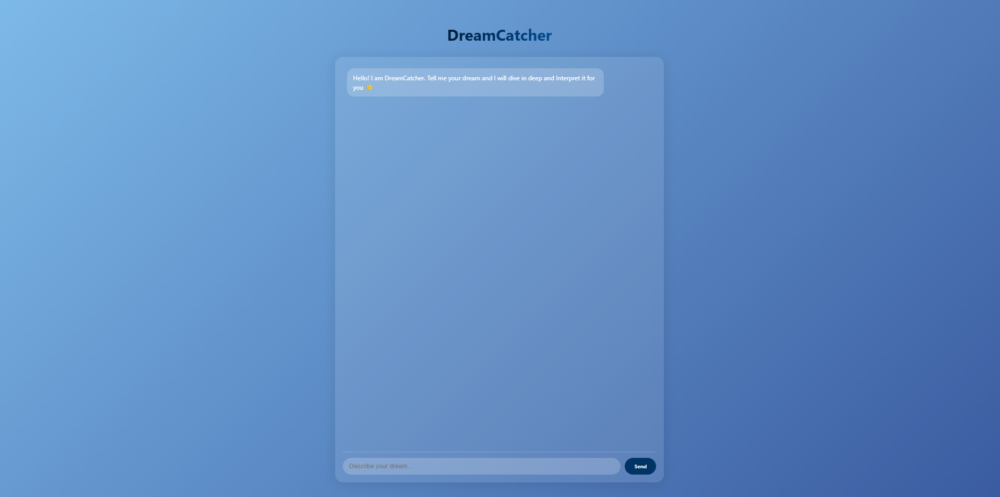
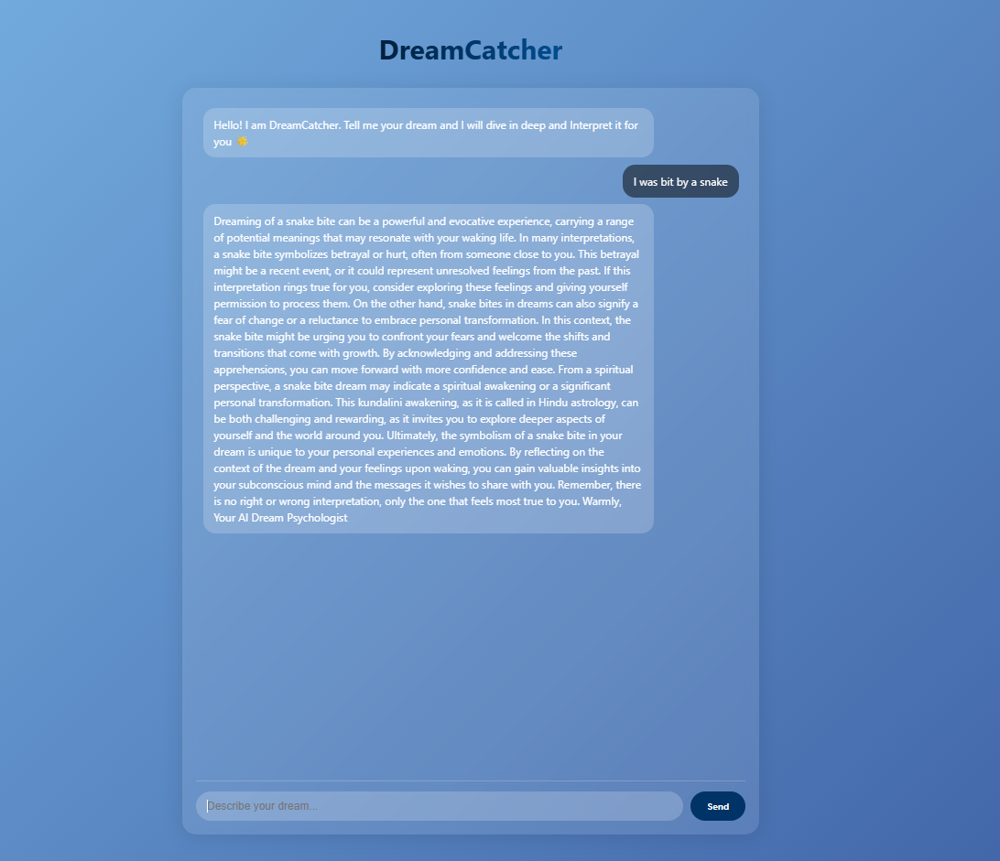

### *DreamCatcher – AI-Powered Dream Interpretation Chatbot*

DreamCatcher is a minimal and elegant full-stack web app that interprets user dreams in real-time. Built with **FastAPI** and **React (Vite)**, and powered by **Tavily Web Search**, it fetches live symbolic meanings instead of using static datasets.

### *Features*
- Real-time dream analysis using Tavily API.
- Searches symbolic dream meanings dynamically from the web.
- Fast, responsive UI (Vite + React)
- Modern and User-friendly UI with gradients and glassmorphism.

### *Tech Stack*

| Layer      | Technology                  |
|------------|-----------------------------|
| Frontend   | React + Vite                |
| Backend    | FastAPI                     |
| Search     | Tavily Web Search API       |
| Styling    | CSS3                        |

### *Getting Started*

## 1.Clone the repo
git clone https://github.com/AbhishekSahukar/DreamCatcher.git
cd DreamCatcher

## 2.Start the backend
# cd backend
# pip install -r requirements.txt
# python -m uvicorn app.main:app --reload

## 3.Start the frontend
''' cd frontend
npm install
npm run dev '''

### *Screenshots*

## Chat Interface

## Example prompt

### *License*
MIT – feel free to use, fork, or build upon.

### *Author*
Abhishek Sahukar Srinivas

